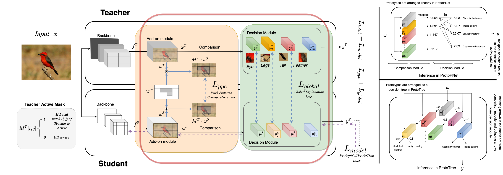

<<<<<<< HEAD

# Fact reproduce Proto2Proto [[arxiv](https://arxiv.org/abs/2204.11830)]


<p align="center" width="100%">

</p>

## Creating conda Environment

```
conda env create -f ./p2p_source_code/environment.yml -n myenv python=3.6
conda activate myenv
```

or 

```
conda create --name myenv python=3.6

conda activate myenv
pip install ./p2p_source_code/requirements.txt
```


## Preparing Dataset

### Refer https://github.com/M-Nauta/ProtoTree to download and preprocess cars dataset, for our project, we have downloaded the datatets and parsed them in ./car_datasets:
- trainDir: car_datasets/train_augmented_less   (augmented datatets from train datasets)
- projectDir: car_datasets/train (train datasets with augmented operation)
- testDir: car_datasets/test 

## Training

- You need to update the trainDir, projectDir, testDir in args.yaml to match your datasets directory. 
- For proto2proto student kd training, set the teacher path in p2p_source_code/Experiments/Resnet50_18_cars/kd_Resnet50_18/args.yaml: backbone.loadPath. Use the teacher model trained previously. For eg. 
```
loadPath: p2p_source_code/Experiments/Resnet50_18_cars/teacher_Resnet50/org/models/teacher_checkpoint_model.pth
```

- In order to save the protopypes for epochs, we need set the dir_path in ./p2p_source_code/src/services/_recognition/protopnet_basic.py for variable root_dir_for_saving_prototypes='./prototypes/teacher_prototypes'
e.g. root_dir_for_saving_prototypes='./prototypes/teacher_prototypes' or root_dir_for_saving_prototypes='./prototypes/student_prototypes' during the training . or  in p2p_source_code/src/services/_kd/protopnet_kd.py, for kd model 
root_dir_for_saving_prototypes='./prototypes/kd_student_prototypes'.

- In our project, we have pre-setup the dir matching with our datasets directory, and loadPath for kd model training to our teacher model , and prototypes dir_path.

## Convert checkpoint model file to complete model
- settingsConfig.backbone.loadPath need to be added or updated in order to match with the trained model you neeed to convert. e.g.
- for converting kd model, you have to access in kd_Resnet50_18/org/args.yaml and change the loadPath to link your trained kd checkpoint model.
```
settingsConfig.backbone.loadPath: p2p_source_code/Experiments/Resnet50_18_cars/teacher_Resnet50/org/models/kd_checkpoint_model.pth
```
And Run the evalution for "teacher_Resnet50", "student_Resnet18", "kd_Resnet50_18"

e.g.
```
import convert
runName= "teacher_Resnet50"  
main.main(runName)
```
- In our project, we have converted the models in converted_models.

## Evaluation
### Initial codebase only cover the AAPs, AJS, and PMS metric evalution, we add the accuracy evalution on 3 trained models

Set model paths in Experiments/Resnet50_18_cars/eval_setting/args.yaml: 
Teacherbackbone.loadPath, StudentBaselinebackbone.loadPath, StudentKDbackbone.loadPath. 

And Run the evalution

```
import main
runName="eval_setting"
main.main(runName)
```
The plotting of metrics of AAPs, AJS, we saved in evaluation_metrics_plotting.


## Things to remember

## Acknowledgement
Our code base is build on top of [ProtoPNet](https://github.com/cfchen-duke/ProtoPNet)

## Citation
If you use our work in your research please cite us:
```BibTeX
@inproceedings{Keswani2022Proto2ProtoCY,
  title={Proto2Proto: Can you recognize the car, the way I do?},
  author={Monish Keswani and Sriranjani Ramakrishnan and Nishant Reddy and Vineeth N. Balasubramanian},
  booktitle={Proceedings of the IEEE/CVF Conference on Computer Vision and Pattern Recognition (CVPR 2022)},
  eprint={2204.11830},
  archivePrefix={arXiv},
  year={2022}
}
```
